<div align="center">




<br>

<a href="https://github.com/plodroid"></a>
<a href="https://plodroid.github.io/portfolio.com/"></a>
<a href="https://youtube.com/@plodroid"></a>

</div>


## ✦ hello

```txt
╭──────────────────────────────────────────────╮
│  plodroid                                    │
│                                              │
│  developer  /  creator  /  professional     │
│  "what happens if I change this setting?"   │
│                                              │
│  OS        Windows + Linux                   │
│  interests tech • minecraft • ui • ai        │
│  usually   coding / tweaking / debugging     │
╰──────────────────────────────────────────────╯
```

I make **apps, websites, Minecraft tools, UI experiments, browser stuff, AI projects and random software**.

I'm equally happy inside a browser devtool panel, a Linux terminal, Windows settings, VS Code, or a Minecraft server console.

> Most projects start with: **“wait… couldn't I just make that myself?”**


<div align="center">

## ✦ currently building

</div>

<table>
<tr>
<td width="50%" valign="top">
<div align="center">


### [Plexium](https://github.com/plodroid/Plexium)
**custom browser project**

</div>

A browser built around custom UI, motion, tools and a more personal browsing experience.

`Electron` `JavaScript` `HTML` `CSS`
</td>

<td width="50%" valign="top">
<div align="center">

### ◇ [ItemStudio](https://github.com/plodroid/ItemStudio)
**Minecraft item tooling**

</div>

A web tool for generating Minecraft items and commands without manually fighting command syntax.

`Minecraft` `JavaScript` `Web`
</td>
</tr>

<tr>
<td width="50%" valign="top">
<div align="center">

### ◇ [Plexity](https://github.com/plodroid/plexity)
**AI + search experiment**

</div>

An experimental search project combining web results, APIs and AI.

`Cloudflare` `JavaScript` `APIs`
</td>

<td width="50%" valign="top">
<div align="center">

### ◇ [Portfolio](https://github.com/plodroid/portfolio.com)
**my work on one page**

</div>

Projects, designs, Minecraft work and everything else I've made.

`HTML` `CSS` `JavaScript`
</td>
</tr>
</table>


<div align="center">

## ✦ stack / stuff I use


<br><br>


<br><br>

`web` • `desktop apps` • `linux` • `windows` • `minecraft` • `apis` • `ui / ux` • `automation` • `pc hardware`

</div>


<div align="center">

## ✦ achievements

<a href="https://github.com/plodroid?tab=achievements"></a>
<a href="https://github.com/plodroid?tab=achievements"></a>
<a href="https://github.com/plodroid?tab=achievements"></a>

<br><br>

**🧠 Galaxy Brain** &nbsp; • &nbsp; **🤠 Quickdraw** &nbsp; • &nbsp; **🌈 YOLO**

<sub>🦈 Pull Shark is apparently still swimming through GitHub's backend</sub>

</div>


<div align="center">

## ✦ github activity


<br>


<br><br>


</div>


<div align="center">

## 👾 contribution arcade

<picture>
  <source media="(prefers-color-scheme: dark)" srcset="https://raw.githubusercontent.com/plodroid/plodroid/output/pacman-contribution-graph-dark.svg">
  <source media="(prefers-color-scheme: light)" srcset="https://raw.githubusercontent.com/plodroid/plodroid/output/pacman-contribution-graph.svg">
  
</picture>

</div>


<div align="center">

## ✦ currently learning / messing with

`JavaScript + TypeScript` &nbsp; `backend development` &nbsp; `APIs`

`Linux` &nbsp; `cloud infrastructure` &nbsp; `C# desktop apps`

`Java + Minecraft plugins/mods` &nbsp; `UI / UX + motion`

`PC hardware` &nbsp; `system tweaking` &nbsp; `automation`

</div>


<div align="center">

## ✦ offline / elsewhere

`⛏ Minecraft` &nbsp; `🖥 PC hardware` &nbsp; `🐧 Linux`

`🦊 Firefox` &nbsp; `⌨ terminals` &nbsp; `🎨 UI design`

`🤖 AI experiments` &nbsp; `🔧 Windows tweaking` &nbsp; `📦 too many repos`

<br><br>


<br><br>


</div>

<!--
Asset root: plodroid/plodroid/assets/

If you ever want one custom image/GIF later, put it in assets/ and use:


The Plexium logo above is loaded directly from plodroid/Plexium.
README pages cannot run custom CSS/JS, so the liquid-glass/motion look is built with animated SVGs and dynamic images.
-->
